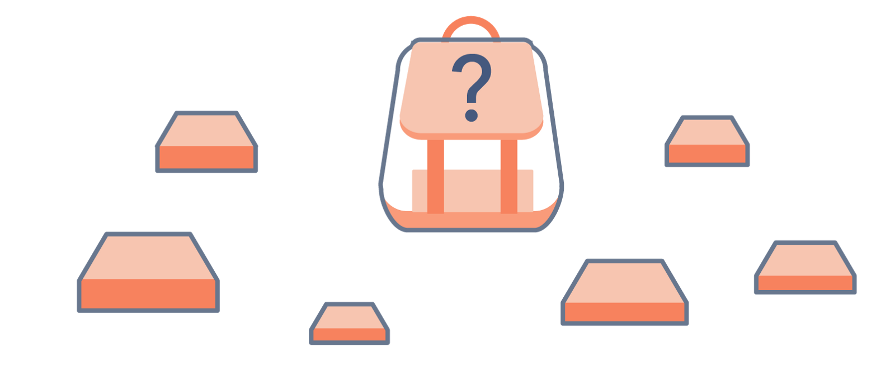
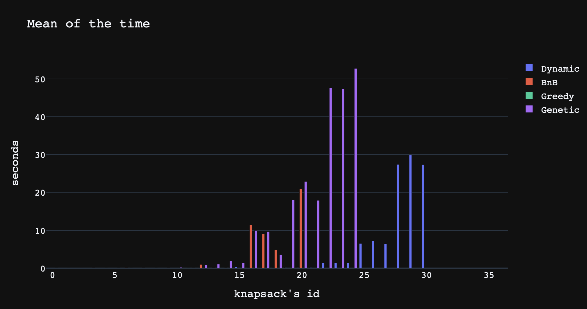
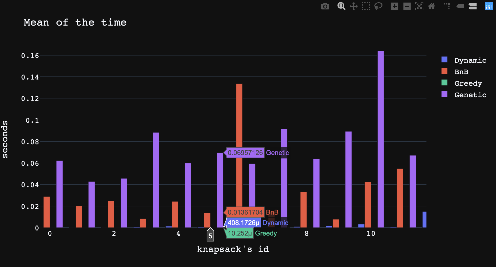

# Knapsack 0-1 problem
  

Given *weights* and *values* of *n items*, put these items in a knapsack of *capacity W* to get the 
maximum total value in the knapsack.     

Here we research different ways to solve the knapsack 0-1 problem and compare them.     
We study the following algorithm:    
* *exact algorithms:* **Dynamic Programming, Branch and Bound**   
* *heuristic algorithms:* **Greedy, Genetic Algorithm**

## Structure of the repo
* analysis of the algorithms and demonstration of the results - [report]() 
* implementation of the algorithms:
    * [Dynamic programming]()
    * [Branch and bound]()
    * [Greedy]()
    * [Genetic]()
* input and output [data]()
* [tools]() for testing, comparisons and other

## The comparison of the time statistics

##### Complexity of the algorithms

| Dynamic  | BnB               | Greedy        | Genetic |
| -------- | ----------------- | ------------- | ------- |
| O(N * W) | O(2^{N-1}-1) (wc) | O(N * log(N)) | O(N)    |
All tests and comparisons are made on [these]() and [these]() benchmarks.            

We put the time limit of 90 seconds. If method works longer than this time we will stop it.        	

Here is the first very long table.

|     | Method               | Knapsack's ID | Number of items | Mean                     | Median                   | Min                      | Max                      | Variance                 |
|-----|----------------------|---------------|-----------------|--------------------------|--------------------------|--------------------------|--------------------------|--------------------------|
| 0   | dynamic\_programming | 0             | 4               | 0\.00023396809895833334  | 0\.0002357959747314453   | 0\.00017213821411132812  | 0\.00029397010803222656  | 2\.475505627646473e\-09  |
| 1   | branch\_and\_bound   | 0             | 4               | 0\.028904040654500324    | 0\.03440117835998535     | 0\.016737937927246094    | 0\.03557300567626953     | 7\.42358909949164e\-05   |
| 2   | greedy\_algorithm    | 0             | 4               | 2\.106030782063802e\-05  | 8\.344650268554688e\-06  | 6\.9141387939453125e\-06 | 4\.792213439941406e\-05  | 3\.611199240872844e\-10  |
| 3   | genetic\_algorithm   | 0             | 4               | 0\.06227850914001465     | 0\.06373095512390137     | 0\.04372882843017578     | 0\.0793757438659668      | 0\.00021283856301579362  |
| 4   | dynamic\_programming | 1             | 4               | 0\.00013105074564615885  | 0\.00013303756713867188  | 0\.0001232624053955078   | 0\.00013685226440429688  | 3\.275444113468337e\-11  |
| 5   | branch\_and\_bound   | 1             | 4               | 0\.020009676615397137    | 0\.01826000213623047     | 0\.016827106475830078    | 0\.02494192123413086     | 1\.250571681844627e\-05  |
| 6   | greedy\_algorithm    | 1             | 4               | 8\.424123128255209e\-06  | 7\.152557373046875e\-06  | 5\.9604644775390625e\-06 | 1\.2159347534179688e\-05 | 7\.21279825989364e\-12   |
| 7   | genetic\_algorithm   | 1             | 4               | 0\.04278063774108887     | 0\.0375361442565918      | 0\.01895880699157715     | 0\.07184696197509766     | 0\.0004799451788812803   |
| 8   | dynamic\_programming | 2             | 5               | 0\.00016601880391438803  | 0\.0001659393310546875   | 0\.00015687942504882812  | 0\.00017523765563964844  | 5\.617392970533627e\-11  |
| 9   | branch\_and\_bound   | 2             | 5               | 0\.02475889523824056     | 0\.024778127670288086    | 0\.024428844451904297    | 0\.025069713592529297    | 6\.863715245546902e\-08  |
| 10  | greedy\_algorithm    | 2             | 5               | 2\.0345052083333332e\-05 | 2\.5033950805664062e\-05 | 1\.0013580322265625e\-05 | 2\.5987625122070312e\-05 | 5\.3521236825165235e\-11 |
| 11  | genetic\_algorithm   | 2             | 5               | 0\.04565238952636719     | 0\.038487911224365234    | 0\.03205132484436035     | 0\.06641793251037598     | 0\.00022250882841490238  |
| 12  | dynamic\_programming | 3             | 5               | 0\.0005136330922444662   | 0\.0005168914794921875   | 0\.0005052089691162109   | 0\.000518798828125       | 3\.608925504118412e\-11  |
| 13  | branch\_and\_bound   | 3             | 5               | 0\.00845495859781901     | 0\.00630497932434082     | 0\.006229877471923828    | 0\.012830018997192383    | 9\.571516797121958e\-06  |
| 14  | greedy\_algorithm    | 3             | 5               | 1\.0172526041666666e\-05 | 7\.867813110351562e\-06  | 7\.3909759521484375e\-06 | 1\.52587890625e\-05      | 1\.2972931371122187e\-11 |
| 15  | genetic\_algorithm   | 3             | 5               | 0\.08830865224202473     | 0\.08421897888183594     | 0\.07042407989501953     | 0\.11028289794921875     | 0\.0002731502768761453   |
| 16  | dynamic\_programming | 4             | 6               | 0\.0012343724568684895   | 0\.0012061595916748047   | 0\.0012030601501464844   | 0\.0012938976287841797   | 1\.7732241354274771e\-09 |
| 17  | branch\_and\_bound   | 4             | 6               | 0\.024295647939046223    | 0\.024564027786254883    | 0\.02320694923400879     | 0\.025115966796875       | 6\.434052137491461e\-07  |
| 18  | greedy\_algorithm    | 4             | 6               | 9\.934107462565104e\-06  | 8\.821487426757812e\-06  | 6\.9141387939453125e\-06 | 1\.4066696166992188e\-05 | 9\.145474501161112e\-12  |
| 19  | genetic\_algorithm   | 4             | 6               | 0\.05988629659016927     | 0\.05700802803039551     | 0\.03594493865966797     | 0\.08670592308044434     | 0\.0004335884715121413   |
| 20  | dynamic\_programming | 5             | 7               | 0\.000408172607421875    | 0\.0003960132598876953   | 0\.0003921985626220703   | 0\.0004363059997558594   | 3\.981692013136732e\-10  |
| 21  | branch\_and\_bound   | 5             | 7               | 0\.01361703872680664     | 0\.013592004776000977    | 0\.01337122917175293     | 0\.013887882232666016    | 4\.4801746904947017e\-08 |
| 22  | greedy\_algorithm    | 5             | 7               | 1\.0251998901367188e\-05 | 8\.821487426757812e\-06  | 6\.9141387939453125e\-06 | 1\.5020370483398438e\-05 | 1\.1975013573343555e\-11 |
| 23  | genetic\_algorithm   | 5             | 7               | 0\.06957125663757324     | 0\.06347894668579102     | 0\.0334630012512207      | 0\.11177182197570801     | 0\.0010406033541509412   |
| 24  | dynamic\_programming | 6             | 7               | 0\.0013917287190755208   | 0\.0013041496276855469   | 0\.001291036605834961    | 0\.0015799999237060547   | 1\.775168180352517e\-08  |
| 25  | branch\_and\_bound   | 6             | 7               | 0\.1336681048075358      | 0\.13421225547790527     | 0\.12842106819152832     | 0\.13837099075317383     | 1\.664820980648882e\-05  |
| 26  | greedy\_algorithm    | 6             | 7               | 1\.0251998901367188e\-05 | 7\.867813110351562e\-06  | 6\.9141387939453125e\-06 | 1\.5974044799804688e\-05 | 1\.6522487082208197e\-11 |
| 27  | genetic\_algorithm   | 6             | 7               | 0\.05948082605997721     | 0\.05100417137145996     | 0\.028476238250732422    | 0\.09896206855773926     | 0\.0008639688830322079   |
| 28  | dynamic\_programming | 7             | 7               | 0\.0004006226857503255   | 0\.0003960132598876953   | 0\.00039577484130859375  | 0\.0004100799560546875   | 4\.472945470802694e\-11  |
| 29  | branch\_and\_bound   | 7             | 7               | 0\.01478433609008789     | 0\.014822959899902344    | 0\.014594078063964844    | 0\.014935970306396484    | 2\.022761691478081e\-08  |
| 30  | greedy\_algorithm    | 7             | 7               | 1\.0331471761067709e\-05 | 9\.059906005859375e\-06  | 8\.106231689453125e\-06  | 1\.3828277587890625e\-05 | 6\.2654079455468385e\-12 |
| 31  | genetic\_algorithm   | 7             | 7               | 0\.0916900634765625      | 0\.07897710800170898     | 0\.040818214416503906    | 0\.1552748680114746      | 0\.002264197210479324    |
| 32  | dynamic\_programming | 8             | 8               | 0\.000985860824584961    | 0\.0009839534759521484   | 0\.0009827613830566406   | 0\.0009908676147460938   | 1\.2770821437394867e\-11 |
| 33  | branch\_and\_bound   | 8             | 8               | 0\.03315567970275879     | 0\.03318190574645996     | 0\.032948970794677734    | 0\.03333616256713867     | 2\.5330147461014956e\-08 |
| 34  | greedy\_algorithm    | 8             | 8               | 1\.0728836059570312e\-05 | 9\.059906005859375e\-06  | 8\.106231689453125e\-06  | 1\.5020370483398438e\-05 | 9\.360216305746386e\-12  |
| 35  | genetic\_algorithm   | 8             | 8               | 0\.06390690803527832     | 0\.04886794090270996     | 0\.03424668312072754     | 0\.10860610008239746     | 0\.0010346390813538164   |
| 36  | dynamic\_programming | 9             | 10              | 0\.0017319520314534504   | 0\.0016489028930664062   | 0\.0016400814056396484   | 0\.0019068717956542969   | 1\.5311431727443253e\-08 |
| 37  | branch\_and\_bound   | 9             | 10              | 0\.007686058680216472    | 0\.007615089416503906    | 0\.007436037063598633    | 0\.008007049560546875    | 5\.686086347446286e\-08  |
| 38  | greedy\_algorithm    | 9             | 10              | 2\.4080276489257812e\-05 | 2\.2172927856445312e\-05 | 1\.0967254638671875e\-05 | 3\.910064697265625e\-05  | 1\.3373361677319431e\-10 |
| 39  | genetic\_algorithm   | 9             | 10              | 0\.0892790158589681      | 0\.07771706581115723     | 0\.06017589569091797     | 0\.1299440860748291      | 0\.0008781060760283153   |
| 40  | dynamic\_programming | 10            | 10              | 0\.003171841303507487    | 0\.003171205520629883    | 0\.003142118453979492    | 0\.003202199935913086    | 6\.018328551565193e\-10  |
| 41  | branch\_and\_bound   | 10            | 10              | 0\.042143662770589195    | 0\.042281150817871094    | 0\.04141378402709961     | 0\.042736053466796875    | 3\.008508934322486e\-07  |
| 42  | greedy\_algorithm    | 10            | 10              | 1\.33514404296875e\-05   | 1\.1205673217773438e\-05 | 1\.0013580322265625e\-05 | 1\.8835067749023438e\-05 | 1\.527193186727042e\-11  |
| 43  | genetic\_algorithm   | 10            | 10              | 0\.22587347030639648     | 0\.26880693435668945     | 0\.13266611099243164     | 0\.27614736557006836     | 0\.004352786236874333    |
| 44  | dynamic\_programming | 11            | 10              | 0\.0006728967030843099   | 0\.0006678104400634766   | 0\.0006659030914306641   | 0\.0006849765777587891   | 7\.356801587674354e\-11  |
| 45  | branch\_and\_bound   | 11            | 10              | 0\.05478374163309733     | 0\.05388307571411133     | 0\.05363130569458008     | 0\.056836843490600586    | 2\.1181783090974527e\-06 |
| 46  | greedy\_algorithm    | 11            | 10              | 1\.2715657552083334e\-05 | 1\.0967254638671875e\-05 | 9\.298324584960938e\-06  | 1\.7881393432617188e\-05 | 1\.380663484774737e\-11  |
| 47  | genetic\_algorithm   | 11            | 10              | 0\.06708025932312012     | 0\.04530787467956543     | 0\.024370908737182617    | 0\.1315619945526123      | 0\.00215200651291525     |
| 48  | dynamic\_programming | 12            | 15              | 0\.014933029810587565    | 0\.014920949935913086    | 0\.014868021011352539    | 0\.01501011848449707     | 3\.4382436650856914e\-09 |
| 49  | branch\_and\_bound   | 12            | 15              | 0\.9659763177235922      | 0\.9402487277984619      | 0\.919614315032959       | 1\.0380659103393555      | 0\.0026694178467828854   |
| 50  | greedy\_algorithm    | 12            | 15              | 2\.5272369384765625e\-05 | 2\.6941299438476562e\-05 | 1\.6927719116210938e\-05 | 3\.1948089599609375e\-05 | 3\.89945853385143e\-11   |
| 51  | genetic\_algorithm   | 12            | 15              | 0\.8726278146107992      | 0\.526008129119873       | 0\.20886015892028809     | 1\.8830151557922363      | 0\.5272050954434663      |
| 52  | dynamic\_programming | 13            | 20              | 0\.023217280705769856    | 0\.023105859756469727    | 0\.02284407615661621     | 0\.023701906204223633    | 1\.2885271240116305e\-07 |
| 53  | branch\_and\_bound   | 13            | 20              | 0\.10984309514363606     | 0\.10860013961791992     | 0\.10700297355651855     | 0\.11392617225646973     | 8\.760915925955082e\-06  |
| 54  | greedy\_algorithm    | 13            | 20              | 2\.7815500895182293e\-05 | 2\.4080276489257812e\-05 | 2\.3126602172851562e\-05 | 3\.62396240234375e\-05   | 3\.563450769029764e\-11  |
| 55  | genetic\_algorithm   | 13            | 20              | 1\.0680396556854248      | 0\.6885740756988525      | 0\.06564688682556152     | 2\.4498980045318604      | 1\.0194392952445621      |
| 56  | dynamic\_programming | 14            | 20              | 0\.025203863779703777    | 0\.025502920150756836    | 0\.024341821670532227    | 0\.025766849517822266    | 3\.831680841257266e\-07  |
| 57  | branch\_and\_bound   | 14            | 20              | 0\.09891597429911296     | 0\.09800481796264648     | 0\.09314417839050293     | 0\.10559892654418945     | 2\.626856153003448e\-05  |
| 58  | greedy\_algorithm    | 14            | 20              | 1\.811981201171875e\-05  | 1\.621246337890625e\-05  | 1\.52587890625e\-05      | 2\.288818359375e\-05     | 1\.152026622245709e\-11  |
| 59  | genetic\_algorithm   | 14            | 20              | 1\.8872324625651042      | 1\.8661820888519287      | 0\.2304232120513916      | 3\.565092086791992       | 1\.8535576431440226      |
| 60  | dynamic\_programming | 15            | 23              | 0\.32927505175272626     | 0\.32055020332336426     | 0\.3181147575378418      | 0\.34916019439697266     | 0\.00019869801502005028  |
| 61  | branch\_and\_bound   | 15            | 23              | 90 seconds have passed\! |                          |                          |                          |                          |
| 62  | greedy\_algorithm    | 15            | 23              | 1\.8596649169921875e\-05 | 1\.6927719116210938e\-05 | 1\.4781951904296875e\-05 | 2\.4080276489257812e\-05 | 1\.5802470443304628e\-11 |
| 63  | genetic\_algorithm   | 15            | 23              | 1\.3660717010498047      | 0\.5845170021057129      | 0\.26022982597351074     | 3\.2534682750701904      | 1\.7986599425792444      |
| 64  | dynamic\_programming | 16            | 100             | 0\.07677491505940755     | 0\.07600092887878418     | 0\.07595586776733398     | 0\.07836794853210449     | 1\.269216239860624e\-06  |
| 65  | branch\_and\_bound   | 16            | 100             | 11\.394863923390707      | 11\.567222833633423      | 10\.0435049533844        | 12\.573863983154297      | 1\.081973266893038       |
| 66  | greedy\_algorithm    | 16            | 100             | 0\.00011308987935384114  | 0\.0001049041748046875   | 0\.00010013580322265625  | 0\.0001342296600341797   | 2\.2723472486379456e\-10 |
| 67  | genetic\_algorithm   | 16            | 100             | 9\.95823891957601        | 10\.290630102157593      | 5\.994413614273071       | 13\.589673042297363      | 9\.669902912294308       |
| 68  | dynamic\_programming | 17            | 100             | 0\.07750781377156575     | 0\.07687807083129883     | 0\.07638335227966309     | 0\.07926201820373535     | 1\.5794076691438224e\-06 |
| 69  | branch\_and\_bound   | 17            | 100             | 8\.96988836924235        | 9\.271592855453491       | 7\.901656150817871       | 9\.736416101455688       | 0\.6065701445773787      |
| 70  | greedy\_algorithm    | 17            | 100             | 0\.00011571248372395833  | 0\.00010704994201660156  | 0\.00010204315185546875  | 0\.0001380443572998047   | 2\.5353427999006173e\-10 |
| 71  | genetic\_algorithm   | 17            | 100             | 9\.654829978942871       | 8\.294238090515137       | 5\.724074840545654       | 14\.946177005767822      | 15\.10013320106024       |
| 72  | dynamic\_programming | 18            | 100             | 0\.07897202173868816     | 0\.0786430835723877      | 0\.07718896865844727     | 0\.08108401298522949     | 2\.5826618765576217e\-06 |
| 73  | branch\_and\_bound   | 18            | 100             | 4\.874316771825154       | 5\.094011306762695       | 4\.315207242965698       | 5\.21373176574707        | 0\.15869056401395987     |
| 74  | greedy\_algorithm    | 18            | 100             | 0\.00011706352233886719  | 0\.00010824203491210938  | 0\.00010395050048828125  | 0\.00013899803161621094  | 2\.4363089323742315e\-10 |
| 75  | genetic\_algorithm   | 18            | 100             | 3\.588234027226766       | 4\.740875005722046       | 0\.3422679901123047      | 5\.681559085845947       | 5\.415628846816705       |
| 76  | dynamic\_programming | 19            | 200             | 0\.15624300638834634     | 0\.15386199951171875     | 0\.15331482887268066     | 0\.16155219078063965     | 1\.4143618740389584e\-05 |
| 77  | branch\_and\_bound   | 19            | 200             | 90 seconds have passed\! |                          |                          |                          |                          |
| 78  | greedy\_algorithm    | 19            | 200             | 0\.00026226043701171875  | 0\.0002281665802001953   | 0\.0001888275146484375   | 0\.00036978721618652344  | 6\.038931132934522e\-09  |
| 79  | genetic\_algorithm   | 19            | 200             | 18\.05766161282857       | 22\.5318341255188        | 8\.470889806747437       | 23\.170260906219482      | 46\.02102828998873       |
| 80  | dynamic\_programming | 20            | 200             | 0\.15781029065450033     | 0\.1581878662109375      | 0\.1540219783782959      | 0\.16122102737426758     | 8\.708999391476229e\-06  |
| 81  | branch\_and\_bound   | 20            | 200             | 20\.931856155395508      | 20\.7788507938385        | 20\.753406763076782      | 21\.26331090927124       | 0\.05503902671697839     |
| 82  | greedy\_algorithm    | 20            | 200             | 0\.00021489461263020834  | 0\.00019979476928710938  | 0\.00019598007202148438  | 0\.00024890899658203125  | 5\.809144770157421e\-10  |
| 83  | genetic\_algorithm   | 20            | 200             | 22\.902313470840454      | 22\.75497031211853       | 22\.50469708442688       | 23\.447273015975952      | 0\.1589299010003439      |
| 84  | dynamic\_programming | 21            | 200             | 0\.1628901163736979      | 0\.16328120231628418     | 0\.1612401008605957      | 0\.16414904594421387     | 1\.4868010238286743e\-06 |
| 85  | branch\_and\_bound   | 21            | 200             | 90 seconds have passed\! |                          |                          |                          |                          |
| 86  | greedy\_algorithm    | 21            | 200             | 0\.00021092096964518228  | 0\.00020694732666015625  | 0\.00019812583923339844  | 0\.0002276897430419922   | 1\.5356565402018732e\-10 |
| 87  | genetic\_algorithm   | 21            | 200             | 17\.899166981379192      | 22\.41744589805603       | 7\.86406397819519        | 23\.415991067886353      | 50\.51782821828818       |
| 88  | dynamic\_programming | 22            | 500             | 1\.3980937004089355      | 1\.4009020328521729      | 1\.3893098831176758      | 1\.404069185256958       | 4\.024953216230642e\-05  |
| 89  | branch\_and\_bound   | 22            | 500             | 90 seconds have passed\! |                          |                          |                          |                          |
| 90  | greedy\_algorithm    | 22            | 500             | 0\.0005932648976643881   | 0\.0005788803100585938   | 0\.0005619525909423828   | 0\.0006389617919921875   | 1\.0918610213492583e\-09 |
| 91  | genetic\_algorithm   | 22            | 500             | 47\.607247273127236      | 47\.779494762420654      | 47\.140661001205444      | 47\.901586055755615      | 0\.11133575522430621     |
| 92  | dynamic\_programming | 23            | 500             | 1\.347678502400716       | 1\.336897850036621       | 1\.3350179195404053      | 1\.371119737625122       | 0\.0002753347775347316   |
| 93  | branch\_and\_bound   | 23            | 500             | 90 seconds have passed\! |                          |                          |                          |                          |
| 94  | greedy\_algorithm    | 23            | 500             | 0\.0005209445953369141   | 0\.0005049705505371094   | 0\.0005018711090087891   | 0\.0005559921264648438   | 6\.157658087128463e\-10  |
| 95  | genetic\_algorithm   | 23            | 500             | 47\.31291278203329       | 47\.053951025009155      | 46\.975640058517456      | 47\.90914726257324       | 0\.17876987913785392     |
| 96  | dynamic\_programming | 24            | 500             | 1\.3972853024800618      | 1\.3664588928222656      | 1\.3647797107696533      | 1\.4606173038482666      | 0\.002005941140712113    |
| 97  | branch\_and\_bound   | 24            | 500             | 90 seconds have passed\! |                          |                          |                          |                          |
| 98  | greedy\_algorithm    | 24            | 500             | 0\.0005936622619628906   | 0\.0005671977996826172   | 0\.0005609989166259766   | 0\.0006527900695800781   | 1\.7544531753325525e\-09 |
| 99  | genetic\_algorithm   | 24            | 500             | 52\.73756512006124       | 53\.11447334289551       | 51\.71876502037048       | 53\.379456996917725      | 0\.5306795443814407      |
| 100 | dynamic\_programming | 25            | 1000            | 6\.512346029281616       | 6\.431317090988159       | 6\.315755844116211       | 6\.7899651527404785      | 0\.040761922484800074    |
| 101 | branch\_and\_bound   | 25            | 1000            | 90 seconds have passed\! |                          |                          |                          |                          |
| 102 | greedy\_algorithm    | 25            | 1000            | 0\.002033392588297526    | 0\.0011589527130126953   | 0\.001154184341430664    | 0\.0037870407104492188   | 1\.5376446577243366e\-06 |
| 103 | genetic\_algorithm   | 25            | 1000            | 90 seconds have passed\! |                          |                          |                          |                          |
| 104 | dynamic\_programming | 26            | 1000            | 7\.1349367300669355      | 6\.824220180511475       | 6\.6352009773254395      | 7\.945389032363892       | 0\.33437117701139923     |
| 105 | branch\_and\_bound   | 26            | 1000            | 90 seconds have passed\! |                          |                          |                          |                          |
| 106 | greedy\_algorithm    | 26            | 1000            | 0\.0007300376892089844   | 0\.0007059574127197266   | 0\.0006990432739257812   | 0\.0007851123809814453   | 1\.524578389459445e\-09  |
| 107 | genetic\_algorithm   | 26            | 1000            | 90 seconds have passed\! |                          |                          |                          |                          |
| 108 | dynamic\_programming | 27            | 1000            | 6\.4328146775563555      | 6\.330722093582153       | 6\.237147092819214       | 6\.7305748462677         | 0\.045789939163468164    |
| 109 | branch\_and\_bound   | 27            | 1000            | 90 seconds have passed\! |                          |                          |                          |                          |
| 110 | greedy\_algorithm    | 27            | 1000            | 0\.0007865428924560547   | 0\.0007929801940917969   | 0\.0006558895111083984   | 0\.0009107589721679688   | 1\.0847126456307402e\-08 |
| 111 | genetic\_algorithm   | 27            | 1000            | 90 seconds have passed\! |                          |                          |                          |                          |
| 112 | dynamic\_programming | 28            | 2000            | 27\.385457356770832      | 27\.58343815803528       | 25\.78085684776306       | 28\.79207706451416       | 1\.5308393977964114      |
| 113 | branch\_and\_bound   | 28            | 2000            | 90 seconds have passed\! |                          |                          |                          |                          |
| 114 | greedy\_algorithm    | 28            | 2000            | 0\.002054135004679362    | 0\.0015180110931396484   | 0\.0014352798461914062   | 0\.0032091140747070312   | 6\.681290693045918e\-07  |
| 115 | genetic\_algorithm   | 28            | 2000            | 90 seconds have passed\! |                          |                          |                          |                          |
| 116 | dynamic\_programming | 29            | 2000            | 29\.875773350397747      | 29\.147170782089233      | 28\.187062978744507      | 32\.2930862903595        | 3\.0753354238605017      |
| 117 | branch\_and\_bound   | 29            | 2000            | 90 seconds have passed\! |                          |                          |                          |                          |
| 118 | greedy\_algorithm    | 29            | 2000            | 0\.002814610799153646    | 0\.0026280879974365234   | 0\.0026149749755859375   | 0\.0032007694244384766   | 7\.458790049794415e\-08  |
| 119 | genetic\_algorithm   | 29            | 2000            | 90 seconds have passed\! |                          |                          |                          |                          |
| 120 | dynamic\_programming | 30            | 2000            | 27\.33617663383484       | 29\.000083923339844      | 23\.984297037124634      | 29\.02414894104004       | 5\.617644936267236       |
| 121 | branch\_and\_bound   | 30            | 2000            | 90 seconds have passed\! |                          |                          |                          |                          |
| 122 | greedy\_algorithm    | 30            | 2000            | 0\.0023598670959472656   | 0\.0022487640380859375   | 0\.0017249584197998047   | 0\.0031058788299560547   | 3\.239954745974198e\-07  |
| 123 | genetic\_algorithm   | 30            | 2000            | 90 seconds have passed\! |                          |                          |                          |                          |
| 124 | dynamic\_programming | 31            | 5000            | 90 seconds have passed\! |                          |                          |                          |                          |
| 125 | branch\_and\_bound   | 31            | 5000            | 90 seconds have passed\! |                          |                          |                          |                          |
| 126 | greedy\_algorithm    | 31            | 5000            | 0\.005049387613932292    | 0\.0045011043548583984   | 0\.004338979721069336    | 0\.006308078765869141    | 7\.965324407955956e\-07  |
| 127 | genetic\_algorithm   | 31            | 5000            | 90 seconds have passed\! |                          |                          |                          |                          |
| 128 | dynamic\_programming | 32            | 5000            | 90 seconds have passed\! |                          |                          |                          |                          |
| 129 | branch\_and\_bound   | 32            | 5000            | 90 seconds have passed\! |                          |                          |                          |                          |
| 130 | greedy\_algorithm    | 32            | 5000            | 0\.0044345855712890625   | 0\.0038139820098876953   | 0\.003674745559692383    | 0\.005815029144287109    | 9\.560433606263057e\-07  |
| 131 | genetic\_algorithm   | 32            | 5000            | 90 seconds have passed\! |                          |                          |                          |                          |
| 132 | dynamic\_programming | 33            | 5000            | 90 seconds have passed\! |                          |                          |                          |                          |
| 133 | branch\_and\_bound   | 33            | 5000            | 90 seconds have passed\! |                          |                          |                          |                          |
| 134 | greedy\_algorithm    | 33            | 5000            | 0\.0038106441497802734   | 0\.0035958290100097656   | 0\.0034520626068115234   | 0\.004384040832519531    | 1\.678366743362858e\-07  |
| 135 | genetic\_algorithm   | 33            | 5000            | 90 seconds have passed\! |                          |                          |                          |                          |
| 136 | dynamic\_programming | 34            | 10000           | 90 seconds have passed\! |                          |                          |                          |                          |
| 137 | branch\_and\_bound   | 34            | 10000           | 90 seconds have passed\! |                          |                          |                          |                          |
| 138 | greedy\_algorithm    | 34            | 10000           | 0\.011635939280192057    | 0\.00984811782836914     | 0\.007294893264770508    | 0\.017764806747436523    | 1\.9868000827551037e\-05 |
| 139 | genetic\_algorithm   | 34            | 10000           | 90 seconds have passed\! |                          |                          |                          |                          |
| 140 | dynamic\_programming | 35            | 10000           | 90 seconds have passed\! |                          |                          |                          |                          |
| 141 | branch\_and\_bound   | 35            | 10000           | 90 seconds have passed\! |                          |                          |                          |                          |
| 142 | greedy\_algorithm    | 35            | 10000           | 0\.007035732269287109    | 0\.006009101867675781    | 0\.0059740543365478516   | 0\.009124040603637695    | 2\.1807205712320865e\-06 |
| 143 | genetic\_algorithm   | 35            | 10000           | 90 seconds have passed\! |                          |                          |                          |                          |
| 144 | dynamic\_programming | 36            | 10000           | 90 seconds have passed\! |                          |                          |                          |                          |
| 145 | branch\_and\_bound   | 36            | 10000           | 90 seconds have passed\! |                          |                          |                          |                          |
| 146 | greedy\_algorithm    | 36            | 10000           | 0\.0072803497314453125   | 0\.00623011589050293     | 0\.005967855453491211    | 0\.009643077850341797    | 2\.802705504715656e\-06  |
| 147 | genetic\_algorithm   | 36            | 10000           | 90 seconds have passed\! |                          |                          |                          |                          |

For the interactive graph and more details welcome to [the report]().

## The solution of each benchmark

We put the time limit of 90 seconds.  
Here is the second very long table. 

